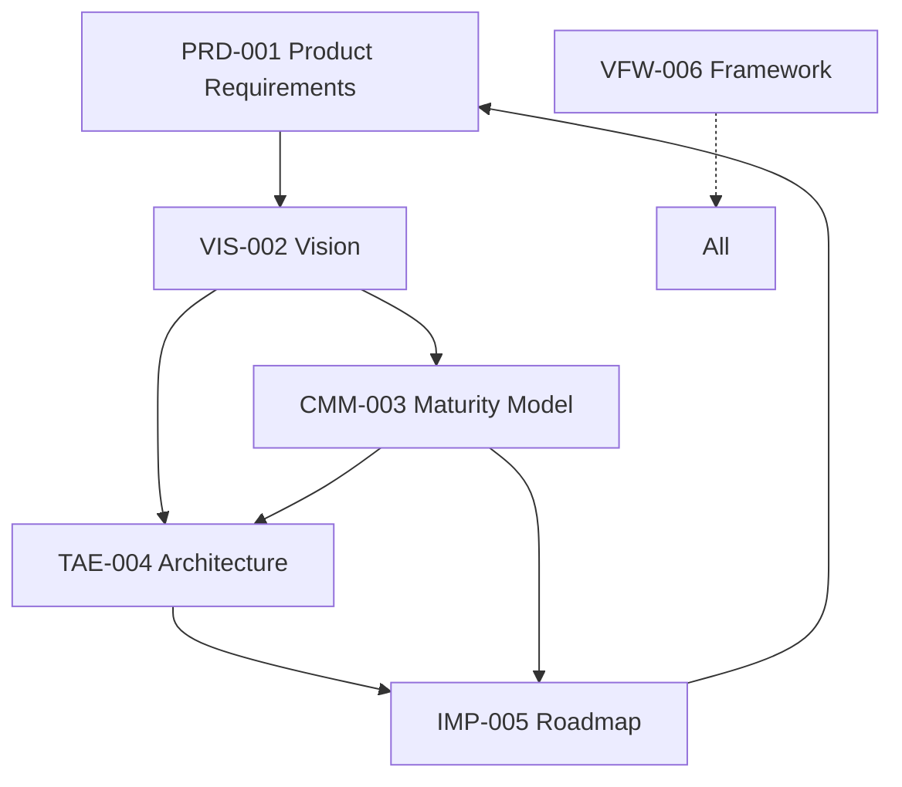

# SyAIPlan Documentation Framework

## Core Document Matrix

| Code  | Document Name                  | Purpose                                | Version |
|-------|--------------------------------|----------------------------------------|---------|
| PRD-001 | Product Requirement Document   | Current implementation specifications  | 1.2     |
| VIS-002 | North Star Vision              | Ultimate aspiration and guiding vision | 1.0     |
| CMM-003 | Capability Maturity Model      | Capability progression framework       | 1.1     |
| TAE-004 | Technical Architecture Evolution | Technical transformation pathway      | 1.0     |
| IMP-005 | Implementation Roadmap         | Concrete action plan with timelines    | 1.0     |
| VFW-006 | Vision Framework               | Document relationships and governance  | 1.0     |

## Document Relationships

## Usage Guidelines

1. **New Contributors**: Start with VFW-006 to understand the documentation system
2. **Developers**: PRD-001 → IMP-005 → TAE-004
3. **Researchers**: VIS-002 → CMM-003 → IMP-005
4. **AI System**: All documents in numerical order

## Version Control
- Major versions updated manually
- Minor versions auto-incremented with each edit
- Full version history maintained in Google Drive 